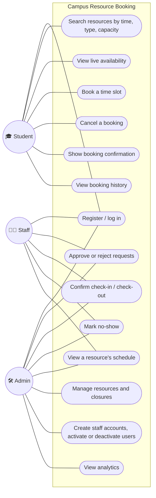
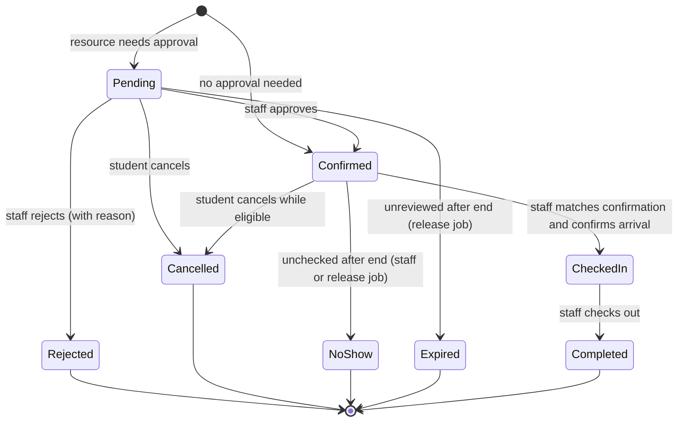
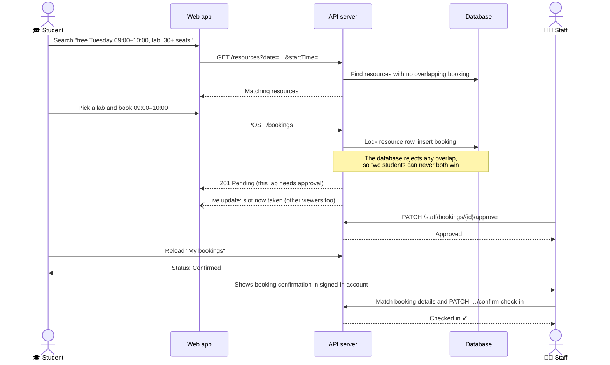

# 1. System overview: roles, use cases, features

**Campus Resource Booking** lets USTH students find and book rooms, laboratories and equipment. Staff approve requests and run check-in. Admins manage the catalog and users, and see how resources are used.

**The problem it solves:** booking by message or on paper causes double bookings, lost requests and no usage data. Here every booking lives in one system, which prevents conflicts and shows availability in real time.

## Three roles

| Role | Who | In one sentence |
| --- | --- | --- |
| 🎓 **Student** | Anyone with an `@usth.edu.vn` email (self-registration) | Finds a free resource, books it, and checks in. |
| 🧑‍💼 **Staff** | Created at first startup, or by an admin | Approves or rejects requests and confirms check-in and check-out. |
| 🛠️ **Admin** | Created at first startup, from `.env` | Manages resources, closures and users, and reads the analytics. |

Registration always creates a **student**. Admins create staff accounts, and no endpoint changes an account's role. At startup, a configured **existing inactive admin** can be reactivated if no active admin remains; an existing student or staff account is never promoted, even when its email matches the bootstrap setting. A missing admin account needs a new, unregistered bootstrap email and password. Admins also have access to everything staff can do.

## Use cases

## Features by role

### 🎓 Student
- **Search**: by keyword, building, type (room, laboratory, equipment), minimum capacity and amenity. A date with both times set to *Any* finds resources free for their entire operating day, only before that day starts; paired times find resources free for a specific interval.
- **Availability grid**: the free hourly slots for a day. When someone else books a slot, it **disappears live**.
- **Book** up to three consecutive whole hours within 08:00–18:00 ICT and the resource's opening hours, such as 09:00–11:00. The booking is confirmed at once, or goes to *pending* if the resource needs staff approval.
- **My bookings**: upcoming bookings and history, with cancellation while eligible and a confirmation for approved bookings.
- **Check-in**: show the confirmed booking in your signed-in account to staff. Staff match its details with their live record and confirm arrival from the scheduled start until the reservation ends.

### 🧑‍💼 Staff
- **Approval queue**: pending requests, oldest first, each approved or rejected with a reason, until the reservation ends.
- **Operations list**: today's bookings, plus earlier visits still waiting for check-out.
- **Check-in**: compare the student's confirmation and identity with the staff booking record, then confirm arrival in the system. **Check-out** when the student leaves.
- **Automatic release**: after the scheduled end, a periodic job records unchecked confirmed bookings as no-shows and unreviewed requests as expired. Until it runs, the booking may still hold the slot; staff can also record a no-show once the reservation ends.
- **Resource schedule**: every booking on a resource for a chosen day.

### 🛠️ Admin
- **Resources**: create and edit rooms, labs and equipment, including capacity, amenities, opening hours and days, and whether approval is needed. Set a resource to *active*, *maintenance* or *inactive*.
- **Closures**: close a resource on specific dates, such as holidays or repairs; unresolved checked-in visits prevent a conflicting closure or schedule change even after their scheduled end.
- **Users**: search accounts, create staff accounts with an initial password, activate or deactivate. Roles cannot be changed. Deactivation revokes existing cookies, including after reactivation; protected REST requests reject them and connected WebSockets are disconnected. A new sign-in is required.
- **Analytics** for a date range: total bookings, status breakdown, cancellation rate, most-booked resources, peak hours and utilization rate.

## A booking's life

A pending request that nobody approves or rejects by its scheduled end is no longer reviewable. The release job then marks it **expired** (and marks an unchecked confirmed booking as a **no-show**). Until that update persists, it may still appear pending or confirmed and hold its slot.

*Pending*, *confirmed* and *checked in* bookings **hold the slot**, so nobody else can book an overlapping time. Cancelled and rejected bookings free future time. Expiry and no-show are recorded at or after the scheduled end; those elapsed hours cannot be rebooked.

## Main flow: from search to check-in

## What makes it more than a CRUD app

| Challenge | How it is solved | Evidence |
| --- | --- | --- |
| **No double booking** | A row lock on the resource, plus a PostgreSQL exclusion constraint that makes overlapping slot-holding bookings impossible | Load test: 100 students booked the same slot at once, 20 times. Each time exactly 1 succeeded and 99 got "409 Conflict". |
| **Fast search** | Database indexes on bookings | Slot search is about 3× less database work and about 1.7× faster for a user ([report](../benchmarks/performance-comparison.md)) |
| **Real-time availability** | WebSocket (Socket.IO) pushes "availability changed" to everyone viewing that resource and day | Open the same grid in two browsers, book in one, and watch the other update |
| **Security** | Session in an `httpOnly` cookie (JavaScript cannot read it), role checks on every route, rate limiting, USTH-only emails | 100 requests per minute per client and route; the 101st gets "429" |
| **Caching** | The building list is cached in memory for 5 minutes | +34% throughput on that route |
