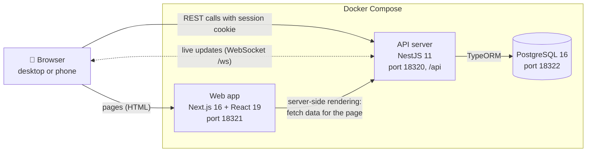
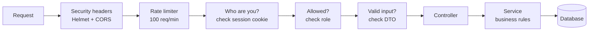
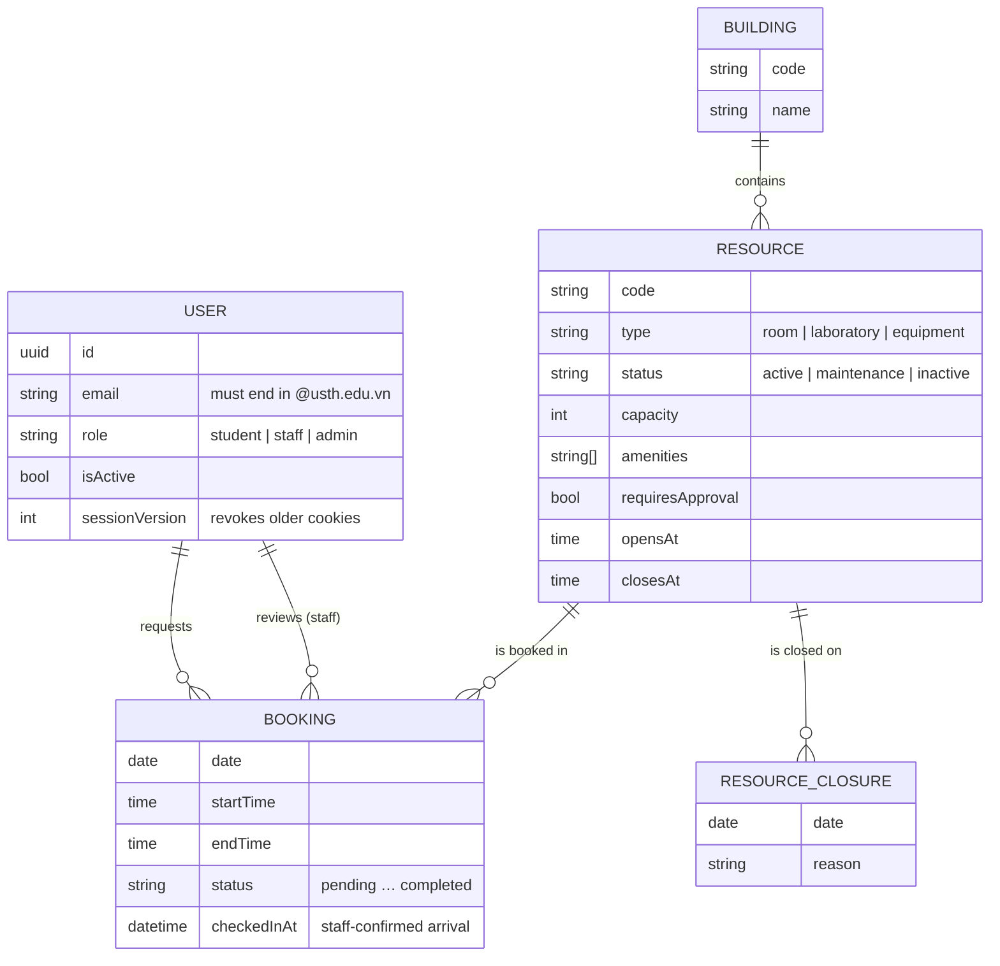
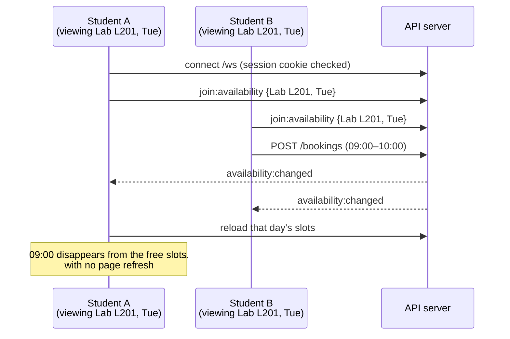

# 2. Architecture and API

## The big picture

| Part | Technology | Job |
| --- | --- | --- |
| **Web app** | Next.js 16, React 19, TypeScript | Screens for the three roles; renders pages on the server for a fast first load |
| **API server** | NestJS 11, TypeORM | Business rules, security, REST endpoints, WebSocket events |
| **Database** | PostgreSQL 16 | Users, buildings, resources, closures, bookings. Migrations define the schema. |
| **Packaging** | Docker Compose | `docker compose up -d --build` starts all three |

## What happens on every request

- Every route **requires login** unless it is explicitly public. Only register, login and health are public.
- The login token is a JWT stored in an **`httpOnly` cookie**, so page JavaScript cannot read the token directly. This reduces token theft from injected scripts but does not eliminate XSS or prevent malicious same-origin actions. Protected REST requests and WebSocket handshakes also compare the token's `sessionVersion` to the user record: deactivation invalidates older cookies, even after reactivation. Pre-upgrade cookies need a new sign-in.
- Unknown or extra input fields are **rejected**, not silently ignored.
- Login and register have a tighter limit (10 per minute, per client and route) to slow password guessing. In production, IP-based limiting assumes a trusted reverse proxy is the only path to the backend; Compose binds the API to host loopback. Validate the real proxy topology before relying on forwarded client IPs.

## Data model

## REST API

Local API base URL: `http://localhost:18320/api` (host loopback only in Compose). Interactive docs (Swagger) are available at `http://localhost:18320/api/docs` outside production.

### Everyone
| Method | Endpoint | What it does |
| --- | --- | --- |
| POST | `/auth/register` | Create a student account (USTH email) and log in |
| POST | `/auth/login` | Log in and receive the session cookie |
| POST | `/auth/logout` | Clear the session cookie |
| GET | `/auth/me` | Who am I? |
| GET | `/health` | Is the server and database up? (public) |

### Browsing resources (any logged-in user)
| Method | Endpoint | What it does |
| --- | --- | --- |
| GET | `/resources` | Search by text, building, type, capacity, amenity; a date with no times requires the entire operating day to be free (before it starts), while paired times search an interval; paginated |
| GET | `/resources/buildings` | Building list for the filter (cached) |
| GET | `/resources/{id}` | One resource's details |
| GET | `/resources/{id}/availability?date=` | The free hourly slots for a day |

### 🎓 Student
| Method | Endpoint | What it does |
| --- | --- | --- |
| POST | `/bookings` | Book a resource for a date and time |
| GET | `/bookings/mine` | My upcoming bookings and history |
| GET | `/bookings/mine/{id}` | One of my bookings |
| PATCH | `/bookings/mine/{id}/cancel` | Cancel while eligible |

### 🧑‍💼 Staff (and admin)
| Method | Endpoint | What it does |
| --- | --- | --- |
| GET | `/staff/bookings/pending` | Requests waiting for approval |
| GET | `/staff/bookings/operations` | Current and overdue bookings |
| GET | `/staff/bookings/resources/{resourceId}/schedule` | One resource's bookings for a day |
| GET | `/staff/bookings/{id}` | Booking details |
| PATCH | `/staff/bookings/{id}/approve` | Approve (until the scheduled end) |
| PATCH | `/staff/bookings/{id}/reject` | Reject with a reason |
| PATCH | `/staff/bookings/{id}/confirm-check-in` | Record arrival after matching the student's confirmation |
| PATCH | `/staff/bookings/{id}/check-out` | Check out |
| PATCH | `/staff/bookings/{id}/no-show` | Mark as no-show (from the scheduled end; also happens automatically) |

### 🛠️ Admin
| Method | Endpoint | What it does |
| --- | --- | --- |
| GET, POST | `/admin/resources` | List or create resources |
| GET | `/admin/resources/buildings` | Building list for the resource form |
| PATCH | `/admin/resources/{id}` | Edit a resource |
| PATCH | `/admin/resources/{id}/status` | Active, maintenance or inactive |
| GET, POST | `/admin/resources/{id}/closures` | List or add closure dates |
| DELETE | `/admin/resources/{id}/closures/{closureId}` | Remove a closure |
| GET | `/admin/users` | Search users |
| POST | `/admin/users` | Create a staff account |
| PATCH | `/admin/users/{id}/status` | Activate or deactivate |
| GET | `/admin/analytics?from=&to=` | Booking and utilization statistics |

### Common answers
| Code | Meaning in this app |
| --- | --- |
| 200 / 201 | OK / created |
| 400 | Invalid input, e.g. a time in the past or the end before the start |
| 401 | Not logged in, or the session expired |
| 403 | Logged in, but your role cannot do this |
| 404 | Not found, or not yours |
| 409 | Conflict: slot already taken, resource closed, or the action is no longer allowed |
| 429 | Too many requests: slow down |

## Real-time updates (WebSocket)

- **`availability:changed`** goes to everyone viewing that resource on that day. The student dashboard's "Today's availability" timeline also receives it for that date and refreshes.
- **`resource:changed`** goes out when an admin creates or edits a resource or changes its status. The dashboard refreshes its sample of up to three resources; the resource detail view refreshes on relevant changes.
- By default, a background job runs every minute (`BOOKING_RELEASE_INTERVAL_SECONDS`; `0` disables it). After the scheduled end it marks unchecked confirmed bookings as no-shows and unreviewed pending requests as expired. Until the update is persisted, their original statuses may still hold the slot; the job sends `availability:changed` so clients can refresh. Elapsed hours cannot be rebooked.
- A WebSocket connection needs a valid session version. It is closed when the session expires or the user is deactivated; a stale cookie cannot reconnect after reactivation. The immediate disconnect signal is in-process, so multiple API instances would need coordinated event delivery.

## Performance in one table

Measured on a synthetic dataset of 50,000 bookings ([full report](../benchmarks/performance-comparison.md)); mixed-read capacity used raised rate limits and is not a production guarantee:

| What | Result |
| --- | --- |
| Database indexes (1 user, mixed browsing) | p95 58 ms → 35 ms |
| Cache on the building list | 467 → 627 requests per second |
| Capacity of one API process | about 250 requests per second of mixed browsing |
| 800 users hammering at once | Slow (p95 3.7 s), but 0 errors and no crash |
| 100 students booking the same slot at once | Exactly 1 succeeds, every time |
